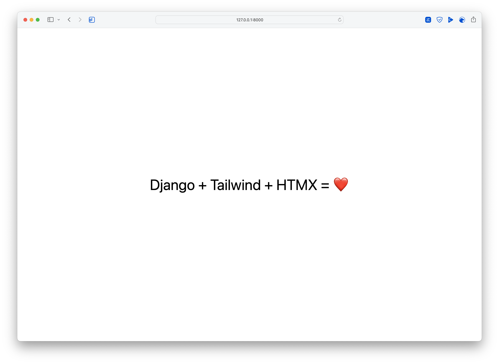

# django-hatch-startproject



I took the inspiration from Jeff Triplett's [django-startproject](https://github.com/jefftriplett/django-startproject) and created my own starter for a fresh django project. It includes even more batteries than Jeff's. 🤷‍♂️

Out of the box SQLite is configured, but you can easily activate MySQL or Postgres support by turning on the corresponding features in the `pyproject.toml` file.

## Features

- Django 4.2.x
- django-browser-reload
- django-environ
- django-htmx
- django-rich
- django-tailwind-cli
- whitenoise
- SQLite setup with WAL mode enabled (See `config/__init__.py`.)
- [Argon2 password hashing is activated](https://docs.djangoproject.com/en/4.1/topics/auth/passwords/)
- Local install of htmx.

### Development tools

- django-types
- model-bakery
- pytest
- pytest-cov
- pytest-django
- pytest-mock
- pre-commit setup inspired by [Boost your Django DX](https://adamchainz.gumroad.com/l/byddx)
- sane ruff configuration
- syrupy for snapshot testing

## Install

```shell
django-admin startproject \
    --extension=ini,py,toml,yaml,yml \
    --template=https://github.com/oliverandrich/django-hatch-startproject/archive/main.zip \
    example_project

# Setup environment
cd example_project
echo "DJANGO_DEBUG=True" >> .env
echo "SECRET_KEY=notsosecret" >> .env

# Install dependencies
hatch env create

# Migrate database
hatch run migrate

# Start dev server
hatch run runserver
```

### Add Postgres support

To activate Postgres support edit the pyproject.toml and change the default environment to look like the following snippet.

```toml
# Default environment
[tool.hatch.envs.default]
dependencies = ["django-types", "ipdb", "model-bakery"]
features = [
  # Uncomment the next line to add the MySQL dependencies
  # "mysql",
  # Uncomment the next line to add the Postgres dependencies
  "postgres",
]
```

Set the environment variable DATABASE_URL to [something reasonable](https://django-environ.readthedocs.io/en/latest/types.html#environ-env-db-url)

### Add MySQL support

To activate Postgres support edit the pyproject.toml and change the default environment to look like the following snippet.

```toml
# Default environment
[tool.hatch.envs.default]
dependencies = ["django-types", "ipdb", "model-bakery"]
features = [
  # Uncomment the next line to add the MySQL dependencies
  "mysql",
  # Uncomment the next line to add the Postgres dependencies
  # "postgres",
]
```

Set the environment variable DATABASE_URL to [something reasonable](https://django-environ.readthedocs.io/en/latest/types.html#environ-env-db-url)

## Contributing

Contributions, issues and feature requests are welcome!
Feel free to check [issues page](https://github.com/oliverandrich/django-hatch-startproject/issues).
